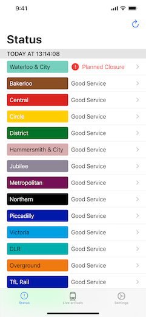
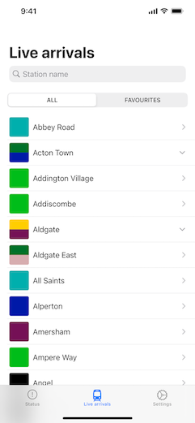
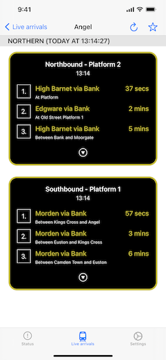
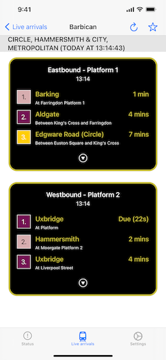

## Tube Service

Welcome to Tube Service iOS app!  This app is a 100% SwiftUI app and is [available on the app store](https://apps.apple.com/app/id1540626286#?platform=iphone).

I decided to make the app open-source as a way of knowledge sharing and demonstrating how to build a production-ready SwiftUI app.

The app uses the [Swift Composable Architecture](https://github.com/pointfreeco/swift-composable-architecture). This is a relatively new and interesting way of building SwiftUI apps in a Redux-like way.

## Screenshots








## Getting Started

1. Install Xcode 12.
1. Clone this repository.
1. Run `Scripts/quick-start.sh`
1. Open the Xcode project file
1. Clean and build the app (Cmd-Shift-K, Cmd-B)

&#42; Quick start will allow you to build & run the app in "preview" mode (i.e. Xcode previews). You can also run the app in preview mode on a simulator by changing the `APP_LAUNCH_MODE` argument from `normal` to `preview` in the Xcode scheme (to run the app in `normal` mode and connect to real servers etc, you will need access to app secrets first.)


## Previews

App previews use fake data (see `Fakes.swift`) to generate the different screen states (e.g. severe delays, good service etc) and they run in a dedicated "preview" environment (i.e. no "real" API or network calls are ever made).

For example, the arrivals picker screen (`ArrivalsPickerView.swift`) can be easily previewed in various different states:


## Unit tests

Since the app uses the [Swift Composable Architecture](https://github.com/pointfreeco/swift-composable-architecture), unit tests are done by sending `actions` to `TestStores`. These `TestStores` make it extremely simple, for example, to switch out a real API call with a mocked one. See the [unit tests](TubeServiceTests) directory for more details.


## Config

My preferred approach to config is to use `.xcconfig` files since they make it easier to handle merge (vs trying to resolve conflicts in a `.pbxproj` file). It also allows potentially sensitive data to be stored in separate `secret.xcconfig` files (which can be decrypted via [`git secret`](https://git-secret.io) to authorised users and CI environments).

The app's config files are set up as follows:

1. Debug (see [`Debug.xcconfig`](Config/Debug.xcconfig)). This is used for previews, unit tests and debugging the app on the simulator or a device and uses AUTOMATIC code-signing.
1. Release (see [`Release.xcconfig`](Config/Release.xcconfig)). This is used for CI  / App Store builds and uses MANUAL code-signing (see [Fastlane/CI](#fastlane-/-CI) below).
1. Adhoc (see [`Adhoc.xconfig`](Config/Adhoc.xcconfig)). This is used for CI / internal builds and uses MANUAL code-signing (see [Fastlane/CI](#fastlane-/-CI) below).

Some xcconfig settings are prefixed with `codeConstant_<SETTING_NAME>`. When building the app, a build phase script runs to generate a `BuildSettings.generated.swift` so that these build constants can then be accessed directly from Swift code (via `BuildSettings.SETTING_NAME`).

This means you can access the build constants directly from source code without having to duplicate them in the `info.plist` file first (more details on this can be found [here](https://medium.com/@hamdullahshah/generating-code-from-xcode-configurations-6fd203ec69ef) and also in [`Base.xcconfig`](Config/Base.xcconfig)).


## Fastlane / CI

* [`Fastlane`](https://fastlane.tools) is used to build and distribute the app.
* [`Fastlane match`](https://docs.fastlane.tools/actions/match/) is used to handle provisioning of CI builds. Although Apple has greatly improved its tools in recent years (e.g. automatic provisioning), I still find `match` to be a more mature and reliable solution, particularly in CI environments. For example, Apple's automatic provisioning still relies on having a user signed into Xcode via the Preferences pane, which can be flaky in a CI environment.
* Since [`Fastlane` now uses the App Store Connect API for most of its actions](https://docs.fastlane.tools/app-store-connect-api/), I have found it to be MUCH faster and easier to use (i.e. no longer need to worry about username/password credentials and all the headaches of 2-factor authentication in a CI environment).
* [`Fastlane snapshot`](https://docs.fastlane.tools/actions/snapshot/) is used to generate / upload screenshots to App Store Connect

The main difference between `Adhoc` and `Release` builds are:

* `Adhoc` builds are used for internal builds and uploaded/distributed via [AppCenter](https://appcenter.ms). 
* `Adhoc` builds are highly customisable (e.g. can specify additional `.xcconfig` files, different bundle ID, app name, point to staging servers etc etc)
* `Adhoc` builds have an image overlay on the app icon to show the build type and version number (e.g. Beta / 1.1) so that it can be clearly distinguished from other builds (e.g. app store builds).
* `Release` builds are used for uploading to [Testflight](https://www.google.com/search?client=safari&rls=en&q=testflight&ie=UTF-8&oe=UTF-8) and are eventually submitted for review.

Command examples

```
# Build and distribute the beta app internally via AppCenter
fastlane build_and_distribute config:beta

# Build and distribute the prod app via Testflight
fastlane build_and_distribute config:prod

# Submit app version 1.1 (build 123) for review (note: can omit "build_no" to submit 
fastlane submit_for_review app_version:1.1 build_no:123

# Generate screenshots & upload to App Store Connect
fastlane snapshot
fastlane upload_screenshots
```

## License

```
Copyright 2021 Ridgeview Consulting Limited.

Licensed under the Apache License, Version 2.0 (the "License");
you may not use this file except in compliance with the License.
You may obtain a copy of the License at

   http://www.apache.org/licenses/LICENSE-2.0

Unless required by applicable law or agreed to in writing, software
distributed under the License is distributed on an "AS IS" BASIS,
WITHOUT WARRANTIES OR CONDITIONS OF ANY KIND, either express or implied.
See the License for the specific language governing permissions and
limitations under the License.
```