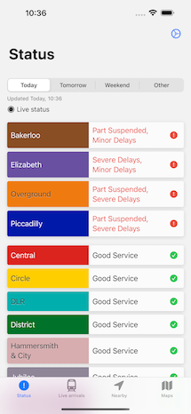
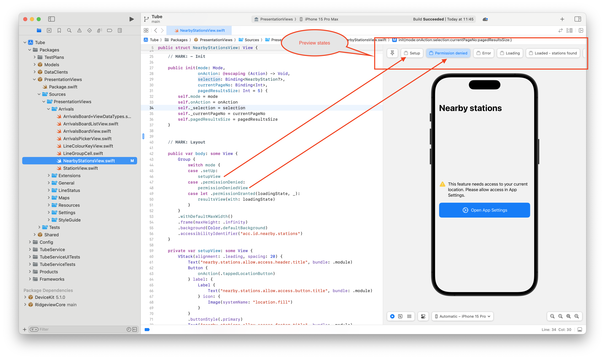

## Tube Service

Welcome to Tube Service iOS app!  This is a SwiftUI app and is available on [the app store](https://apps.apple.com/app/id1540626286#?platform=iphone).

## Screenshots




## Getting Started

1. Install Xcode.
1. Run `Scripts/quick-start.sh`
1. Select an iOS simulator and tap "Run"

## Architecture

The app uses the [MV architecture](https://azamsharp.com/2023/02/28/building-large-scale-apps-swiftui.html) but I have previously used both MVVM and the [Swift Composable Architecture](https://github.com/pointfreeco/swift-composable-architecture).

> The original app's source code (developed using The Composable Architecture) is available [here](https://github.com/ridgeview-apps/tube-service/tree/legacy/tca).

Swift Package Manager is used to modularize the app as follows:

* `Models` - the main data structures / models used globally across the app (e.g. API models)
* `DataStores` - this covers the main data requirements / business logic for the app (including networking logic and also Observable objects).
* `PresentationViews` - these are plain ("dumb") views / reusable components. As the name suggests, they are purely for presentation purposes (hence perfect for SwiftUI previews). The components are typically just parts of a screen and contain no business logic.
* `Shared` - shared logic that can be used by ANY part of the app (i.e. any package or target - for example, `String`, `Date` extensions etc)

The main app target itself is predominantly just composed of "screens" (which do all the heavy lifting and wire everything together - see example below).

### Line status feature example

The current tube line statuses are a good example of data used in more than one part of the app. The feature is set up as follows:

* The data objects (e.g. `Line`, `LineStatus`) are defined in the `Models` package.
* The `LineStatusDataStore` (in the `DataStores` package) is responsible for loading and storing line status data (as an `ObservableObject` / `EnvironmentObject` which can then be used globally across the app). The `ObservableObject` resides here rather than in the the main app target as this makes it more reusable across other targets (for example, widget extensions, watch etc).
* The `PresentationViews` package uses the model objects to build reusable / previewable components (i.e. so has access to the `Models` package but NOT the `DataStores` package)
* In the main app target, `LineStatusDataStore` is used in a couple of places (`LineStatusScreen` and `NearbyStationsScreen`). These are completely separate screens and assembled with different presentation views but both share the same `LineStatusDataStore` object as their source of truth (hence any updates on one screen will automatically reflect on the other).

> Note: The `PresentationViews` package used to be a completely standalone package (and I have developed other apps in this way before). However, by isolating it completely in this way, I found myself constantly duplicating data structures that were already inside the `Models` package (and I found the extra transformation from `Models` object -> `PresentationViews` object to be unnecessary in the vast majority of cases).

## Previews

App previews use stub data (see `ModelStubs.swift`) to generate the different screen states (e.g. severe delays, good service etc)

For example, the "Nearby stations" view (`NearbyStationsView.swift`), which requires access to the user's current location, can be quickly previewed in various different states (setup, loading, loaded, permission denied etc):



## Unit tests

Unit tests are written for the key parts of the app (model layer, data stores, presentation views) and each Swift package's unit tests can either be run in isolation or all at once with the main app target.

> Note: when using other approaches such as MVVM, pretty much all my tests were for view models. However, on SwiftUI, this always felt unnatural to me (i.e. view models served a great purpose in UIKit, RxSwift-world, but less so on SwiftUI). I took a closer look at what I was actually testing in the view models and found much of it was unnecessary (and the bits that *were* important could be easily extracted out & unit tested separately).

## Config

My preferred approach to config is to use `.xcconfig` files since they make it easier to handle merge conflicts (vs trying to resolve conflicts in a `.pbxproj` file). It also allows potentially sensitive data to be stored in separate `secret.xcconfig` files (which can be decrypted via [`git secret`](https://git-secret.io) to authorised users and CI environments).

The app's config files are set up as follows:

1. Debug (see [`Debug.xcconfig`](Config/Debug.xcconfig)). This is used for previews, unit tests and debugging the app on the simulator or a device and uses AUTOMATIC code-signing.
1. Release (see [`Release.xcconfig`](Config/Release.xcconfig)). This is used for CI  / App Store builds and uses MANUAL code-signing (see [Fastlane/CI](#fastlane-/-CI) below).
1. Additional xcconfig files are used to build the app for specific environments (e.g. `Beta.xcconfig`)

Note that the Xcconfig files themselves contain two "kinds" of config:

1. Build settings (e.g. code signing settings, compilation settings, bundle ID)
1. Environment settings (API urls etc)

The environment settings are exposed in the `Info.plist` file and are loaded / referenced from Swift code as `AppConfig`.


## Fastlane / CI

* [`Fastlane`](https://fastlane.tools) is used to build and distribute the app.
* [`Fastlane match`](https://docs.fastlane.tools/actions/match/) is used to handle provisioning of CI builds. Although Apple has greatly improved its tools in recent years (e.g. automatic provisioning), I still find `match` to be a more mature and reliable solution, particularly in CI environments. For example, Apple's automatic provisioning still relies on having a user signed into Xcode via the Preferences pane, which can be flaky in a CI environment.
* Since [`Fastlane` now uses the App Store Connect API for most of its actions](https://docs.fastlane.tools/app-store-connect-api/), I have found it to be MUCH faster and easier to use (i.e. no longer need to worry about username/password credentials and all the headaches of 2-factor authentication in a CI environment).
* [`Fastlane snapshot`](https://docs.fastlane.tools/actions/snapshot/) is used to generate / upload screenshots to App Store Connect
* `Release` builds are used for uploading to [Testflight](https://www.google.com/search?client=safari&rls=en&q=testflight&ie=UTF-8&oe=UTF-8) and are eventually submitted for review.

Command examples

```ruby
fastlane unit_tests           # Run unit tests
fastlane add_badge_overlay    # Add a 'Beta' badge overlay
fastlane build                # Build / archive the app
fastlane distribute           # Distribute the app via TestFlight
fastlane snapshot             # Generate App Store screenshots
fastlane upload_screenshots   # Upload screenshots to App Store Connect
fastlane submit_for_review    # Submit the app for review
```